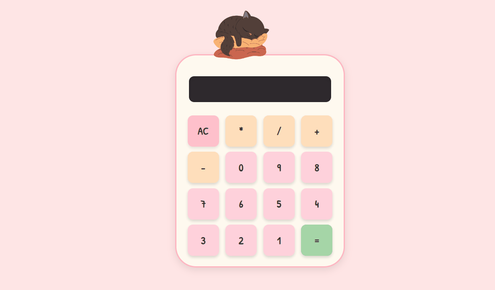

# 🐱 Мяукающий калькулятор

Милый калькулятор, созданный на React. Каждая кнопка слегка подпрыгивает при нажатии, и издает звук "мяу", когда вы подсчитываете результат. Создан для отработки CSS-анимации с добавлением звуков, создания привлекательного пользовательского интерфейса и работы с TypeScript.

